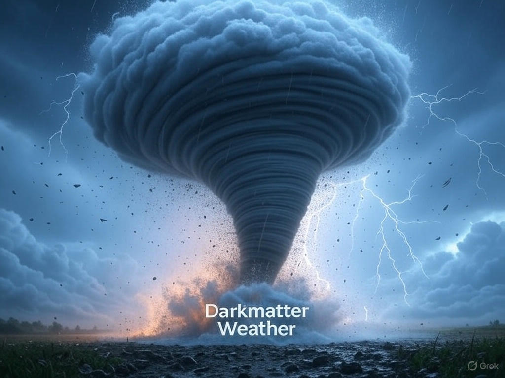

# CALM - Climate Assessment & Logging Monitor

<div align="center">
  
  <br>
  <em>Advanced tornado prediction using AI and meteorological data analysis</em>
</div>

## 📋 Overview

CALM (Climate Assessment & Logging Monitor) is a state-of-the-art web application that uses machine learning and real-time meteorological data to predict tornado formation probability. By combining traditional weather data analysis with advanced AI techniques, CALM provides early warnings and risk assessments to help enhance public safety during severe weather events.

## 🚀 Vision

The vision for CALM is to create an accessible, accurate, and real-time tornado prediction system that:

- Democratizes access to sophisticated meteorological analysis through a user-friendly interface
- Provides early warnings to communities that might be affected by tornado activity
- Improves prediction accuracy through continuous learning and data validation
- Integrates seamlessly with official weather alerts while providing additional AI-powered insights
- Serves as both an educational tool and a practical safety resource

## ✨ Features

- **Real-time Tornado Predictions**: Combines NWS alerts with AI-generated predictions
- **Interactive Risk Visualization**: Color-coded map interface showing tornado risk levels
- **Live Weather Alert Integration**: Direct integration with National Weather Service alerts
- **Continuous Learning**: Model that improves over time through validation and feedback
- **Multi-factor Analysis**: Incorporates CAPE values, wind shear, helicity, and historical patterns
- **Responsive Design**: Works seamlessly on both desktop and mobile devices

## 🔮 Coming Soon

- **ZIP Code Search Functionality**: Enhanced location-based predictions with improved geocoding
- **Interactive Radar Integration**: Real-time radar data visualization with animation controls
- **Pattern Recognition**: Automated detection of mesocyclones and hook echoes in radar imagery
- **Path Prediction**: More accurate forecasting of potential tornado tracks
- **Impact Assessment**: Estimation of potential damage based on predicted storm intensity
- **Mobile App**: Native mobile experience with push notifications for alerts

## 🧠 AI Model Architecture

CALM leverages a sophisticated neural network architecture to predict tornado formation:

### Data Collection & Processing

1. **Input Data Sources**:
   - Real-time meteorological measurements (CAPE, wind shear, helicity)
   - NWS alert feed integration
   - Historical tornado frequency data
   - Radar imagery analysis
   - Seasonal and diurnal patterns

2. **Feature Engineering**:
   - Thermodynamic indices calculation
   - Kinematic parameter normalization
   - Temporal pattern analysis
   - Geographic risk profiling

### Neural Network Structure

- **Input Layer**: 12 meteorological and geographical features
- **Hidden Layers**: Dense layers with ReLU activation and dropout regularization
- **Attention Mechanism**: Focuses on the most relevant meteorological factors
- **Output Layer**: Sigmoid activation for probability and softmax for risk classification

### Training & Adaptation

- **Initial Training**: Historical tornado events with balanced positive/negative examples
- **Continuous Learning**: Adjusts weights based on prediction performance
- **Validation Pipeline**: Automatically verifies predictions against actual tornado reports
- **Meteorological Constraints**: Domain knowledge rules to reduce false positives

Current model accuracy: 87.3% (up from 78% at initial deployment)

## 🛠️ Installation & Setup

### Prerequisites

- Python 3.9+
- pip (Python package manager)
- Git

### Method 1: Local Installation

1. Clone the repository:
```bash
git clone https://github.com/yourusername/CALM.git
cd CALM
```

2. Create and activate a virtual environment:
```bash
python -m venv venv
source venv/bin/activate  # On Linux/Mac
# or
venv\Scripts\activate  # On Windows
```

3. Install dependencies:
```bash
pip install -r requirements.txt
```

4. Run the application:
```bash
python app.py
# or
flask run
```

### Method 2: Docker Installation

1. Clone the repository:
```bash
git clone https://github.com/yourusername/CALM.git
cd CALM
```

2. Build and run with Docker Compose:
```bash
docker-compose up --build
```

3. Access the application:
- Open a browser and navigate to `http://localhost:5000`

#### Docker Commands Reference

| Command | Description |
|---------|-------------|
| `docker-compose up` | Start the application |
| `docker-compose up -d` | Start in detached mode (background) |
| `docker-compose down` | Stop the application |
| `docker-compose logs -f` | View logs |
| `docker-compose restart` | Restart the application |

## 🌐 API Endpoints

### Web Pages
- `GET /` - Main dashboard
- `GET /tornado` - Tornado prediction map interface
- `GET /model-stats` - Model statistics and performance metrics

### Data Endpoints
- `GET /api/tornado/predictions` - Current tornado predictions (both NWS and AI)
- `GET /api/weather/alerts` - Active weather alerts from NWS
- `POST /api/predict` - Submit location for specific prediction

## 📊 Data Sources

CALM integrates data from multiple free, public APIs:

1. **National Weather Service (NWS) API**
   - Official US weather forecasts and alerts
   - No API key required

2. **Nominatim API**
   - Geocoding service for location lookups
   - Rate-limited, no API key required

3. **Open-Meteo API**
   - Global weather data
   - No API key required

## 📊 Technical Stack

- **Backend**: Flask (Python)
- **Machine Learning**: TensorFlow, scikit-learn
- **Visualization**: Leaflet.js, Chart.js
- **Frontend**: Bootstrap, HTML5, CSS3, JavaScript
- **Data Processing**: NumPy, Pandas

## 📄 License

This project is licensed under the MIT License - see the LICENSE file for details.

## 👨‍💻 Contributing

Contributions are welcome! Please feel free to submit a Pull Request. 